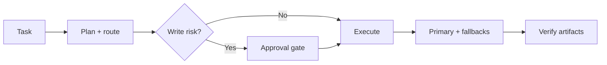

# Super Browser

**The agent plugin that picks the right browser backend — then proves the run worked.**

Super Browser is a drop-in skill pack, CLI, and MCP server for Claude Code, Codex, Cursor, and any MCP client. One task might need local Playwright; another needs anti-bot cloud browsers, hosted Chromium, a full desktop VM, or raw HTTP through a proxy. Super Browser classifies the job, routes to the cheapest provider that can do it, stops risky writes for human approval, and saves artifacts plus a verification report.

**Repo:** [github.com/jbellsolutions/super-browser](https://github.com/jbellsolutions/super-browser)

---

## Start here (60 seconds)

```bash
git clone https://github.com/jbellsolutions/super-browser.git && cd super-browser
./scripts/super-browser setup          # step-by-step plan + API signup links
cp .env.example .env                   # fill locally — never commit .env
pip install -e ".[playwright]" && playwright install chromium
./scripts/super-browser doctor
```

Tell your agent:

> Use the **super-browser-orchestrator** skill for every browser or computer task. Run `setup` first, then `plan` before `run`. External writes require approval.

Human guide: [docs/setup-walkthrough.md](docs/setup-walkthrough.md) · Agent cheat sheet: [docs/agent-quickstart.md](docs/agent-quickstart.md)

---

## What you get

| Piece | What it does |
| --- | --- |
| **Orchestrator + specialist skills** | Classify tasks, pick providers, gate publishing, verify results |
| **`super-browser` CLI** | Plan, run, approve, resume, verify — JSON in/out for scripts |
| **MCP server** | Same runtime as tools (`plan_browser_task`, `run_browser_task`, `setup_walkthrough`, …) |
| **Codex / Claude plugins** | `.codex-plugin/` and `.claude-plugin/` bundle skills + MCP |
| **Durable runs** | SQLite store, artifacts, `run-report.json`, handoff for another agent |


---

## Supported providers (current lineup)

Capability picks the provider; **rank** is only the cost tie-breaker when several can do the job.

| Rank | Provider | Best for |
| --- | --- | --- |
| **1** | **Playwright** (local) | Deterministic tests, screenshots, cheap extraction |
| **1** | **Browser Use** | Anti-bot, profiles, hardened cloud Chromium |
| **2** | **Hyperbrowser** | Cloud scrape jobs, scale browser automation |
| **2** | **Airtop** | Cloud sessions, page-query, GTM / webhook workflows |
| **3** | **Steel** | Hosted Chromium via Playwright CDP |
| **4** | **Orgo** | Full desktop — files, terminal, multi-window |
| **Lane** | **Decodo HTTP** | Raw `http(s)://` endpoints + optional residential proxy |

Full matrix: [references/provider-matrix.md](references/provider-matrix.md) · Routing rules: [references/routing-playbook.md](references/routing-playbook.md)


---

## How a run works



1. **Plan** — classify the task, build provider order and cost estimate (`council_report`).
2. **Approve** — posts, DMs, purchases, CRM changes, and credential use stop until a human approves.
3. **Execute** — try primary provider, then fallbacks; timeouts and target-scope guards enforced in code.
4. **Verify** — artifacts hashed, run report checked, policy summarized for handoff.

Safety details: [references/security-and-approval-policy.md](references/security-and-approval-policy.md)

---

## Example commands

```bash
# Read-only extraction (local first)
super-browser plan --goal "Extract product names from https://example.com"

# Cheap raw HTTP
super-browser run --goal "Fetch JSON" --url "https://example.com/data.json" \
  --allow-provider decodo-http --max-cost-usd 0.01

# Draft without publishing (still plan first)
super-browser run --goal "Draft a LinkedIn comment but do not publish"

# After approval
super-browser approve <run-id> --by "you" --reason "approved exact text" --execute
super-browser verify <run-id>
```

Install the skill bundle elsewhere:

```bash
./scripts/super-browser install-skill --target ~/.codex/skills --force
./scripts/super-browser init-mcp --path ~/.cursor/mcp.json --merge
```

---

## MCP tools (high level)

`setup_walkthrough` · `plan_browser_task` · `run_browser_task` · `resume_browser_run` · `get_browser_run` · `handoff_browser_run` · `list_browser_runs` · `verify_browser_run` · `approve_browser_run` · `deny_browser_run` · `list_browser_providers` · `browser_doctor` · `production_readiness` · `env_checklist` · `bundle_manifest` · `run_browser_live_tests` · `install_super_browser_skill` · `init_super_browser_mcp`

Read-only docs via MCP resources: `super-browser://references/provider-matrix`, routing playbook, and each specialist skill.

---

## Production checklist

```bash
./scripts/verify-super-browser      # full local gate (tests + doctor + fixtures)
super-browser production-readiness
super-browser env-checklist
super-browser live-test --provider all   # needs API keys in .env
```

Cloud providers stay **evaluating** until live tests pass for your workflow class. See [references/live-test-matrix.md](references/live-test-matrix.md).

---

## Install options

| Client | Path |
| --- | --- |
| **Codex** | `.codex-plugin/plugin.json` — set `SUPER_BROWSER_REPO_ROOT` to this repo |
| **Claude Code** | `.claude-plugin/plugin.json` — same env var |
| **Cursor / Hermes** | `install-skill` + merge `.mcp.json` into your MCP config |
| **Python only** | `pip install -e .` or `pip install -e ".[all-providers]"` |

Optional extras: `.[playwright]`, `.[browser-use]`, `.[mcp]`, `.[all-providers]`.

---

## Docs map

| Doc | Use when |
| --- | --- |
| [setup-walkthrough.md](docs/setup-walkthrough.md) | Onboarding humans or agents step by step |
| [agent-quickstart.md](docs/agent-quickstart.md) | Drop-in GitHub link for another agent |
| [slack-agent-setup.md](docs/slack-agent-setup.md) | Slack / agent-os integration |
| [provider-matrix.md](references/provider-matrix.md) | Provider capabilities and env vars |
| [routing-playbook.md](references/routing-playbook.md) | How routing and fallbacks work |
| [security-and-approval-policy.md](references/security-and-approval-policy.md) | Approval, target scope, redaction |

Older research notes under `docs/research-*.md` and `docs/anti-detection-results.md` are **historical** (they mention providers we removed). Do not use them for the current lineup.

---

## Development

```bash
python3 -m pip install -e .
python3 -m unittest discover -s tests
./scripts/verify-super-browser
```

Run store defaults to `.super-browser/` (override with `SUPER_BROWSER_STATE_DIR`).

---

MIT · [AI Integraterz](https://github.com/jbellsolutions)
