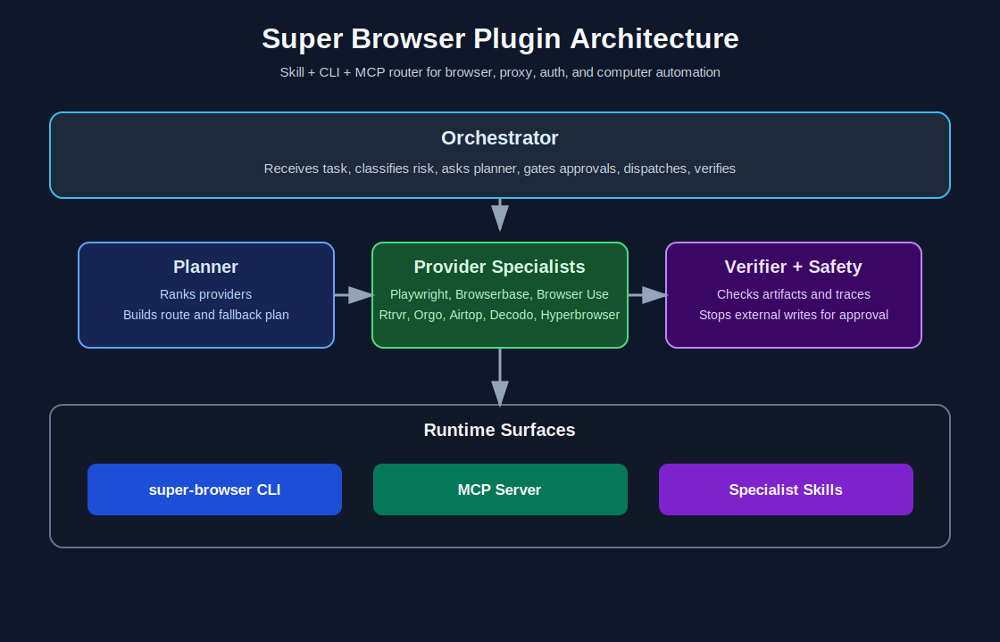
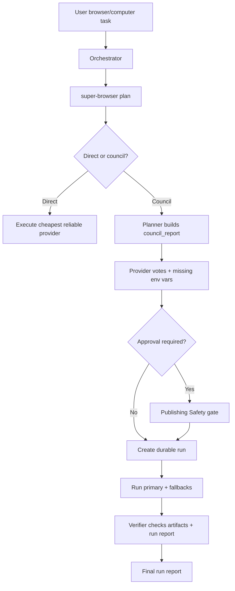

# Super Browser

Universal browser and computer automation for agents.

Super Browser is a plugin, skill suite, CLI, and MCP server that helps an agent choose the right automation surface for a job: local Playwright, Browserbase/Stagehand, Browser Use Cloud, Rtrvr, Orgo, Airtop, Decodo/raw HTTP, Hyperbrowser, Steel, or Browserless.



## What This Solves

Browser automation fails when every task is routed through the same tool. A simple public page, an authenticated LinkedIn workflow, a Cloudflare-heavy site, a raw JSON endpoint, and a full desktop task need different backends.

Super Browser gives agents a repeatable flow:

1. Classify the task.
2. Pick the cheapest reliable provider.
3. Produce a `council_report` with provider specialist recommendations.
4. Stop external writes for approval.
5. Execute the primary provider and fallbacks until one succeeds or all are blocked.
6. Save a durable run record and `run-report.json`.
7. Verify artifacts before claiming success.

## Install Paths

### Skill/plugin bundle

Install a self-contained bundle into an agent skill directory, or run without `--target` to print the exact source and destination plan.

```bash
./scripts/super-browser install-skill --target ~/.codex/skills
./scripts/super-browser install-skill --target ~/.codex/skills --force
```

`--force` replaces the installed bundle so stale files from older Super Browser versions do not remain in another agent's skill directory. The installer refuses destinations inside the source repo or destinations that contain the source repo, so a forced update cannot delete the checkout it is copying from. Installed bundles exclude local-only secrets, state, caches, dependency folders, logs, sqlite files, symlinks, and build output.

Each installed bundle includes `super-browser-manifest.json`, a hashed handoff inventory of files, entrypoints, providers, skills, MCP tools, and docs resources. Use it when handing the plugin to another agent or auditing what was actually installed.

### CLI

```bash
python3 -m pip install -e .
super-browser doctor
super-browser providers
super-browser plan --goal "Extract all product names from https://example.com"
super-browser plan --goal "Extract with a cheap route" --allow-provider decodo-http --max-cost-usd 0.01
super-browser run --goal "Fetch a slow endpoint" --url "https://example.com/data.json" --timeout-seconds 60
super-browser get <run-id>
super-browser handoff <run-id>
super-browser runs --status awaiting_approval --limit 20
super-browser production-readiness
super-browser env-checklist
super-browser bundle-manifest
super-browser live-test --provider local
super-browser live-test --provider fixtures
super-browser live-test --provider browserless
super-browser live-test --provider browserless --workflow-class general_read
```

Without installing:

```bash
./scripts/super-browser doctor
./scripts/super-browser providers
./scripts/super-browser plan --goal "Extract all product names from https://example.com"
./scripts/super-browser production-readiness
./scripts/super-browser env-checklist
./scripts/super-browser bundle-manifest
./scripts/super-browser live-test --provider local
./scripts/super-browser live-test --provider decodo-http --workflow-class raw_http_direct
./scripts/super-browser get <run-id>
./scripts/super-browser handoff <run-id>
./scripts/super-browser runs --limit 20
./scripts/super-browser resume <run-id>
```

CLI commands print JSON on stdout for successful responses. Known Super Browser command failures print redacted JSON on stderr with `error` and `error_type`; shell parser errors from missing flags or invalid subcommands remain normal argparse usage errors.

### MCP

Use the included `.mcp.json`, print an absolute config, or write one to a client config path:

```bash
./scripts/super-browser init-mcp
./scripts/super-browser init-mcp --path /tmp/super-browser.mcp.json
./scripts/super-browser init-mcp --path /tmp/existing-mcp.json --merge
./mcp/super-browser-server
```

Use `--merge` when the config file already contains other MCP servers. Use `--force` only when the file should be replaced. `--cwd` must point to this repository or an installed Super Browser bundle with an executable `mcp/super-browser-server`; invalid bundle paths fail before a config file is written.

If `super-browser` was installed as a normal Python package instead of run from this repository or an installed bundle, `init-mcp` emits a module-based MCP server command using the installed Python executable. Normal package installs include a `share/super-browser` asset tree with the README, root skill, specialist skills, references, examples, MCP wrapper, scripts, source, and tests. `init-mcp` points `SUPER_BROWSER_REPO_ROOT` at that verified asset tree so MCP markdown resources work without exposing the caller's current working directory, and `install-skill` can copy the full bundle from the package assets. If an intentionally minimal or broken package omits those assets, `install-skill` reports `source_unavailable` instead of copying the Python library directory.

The MCP server exposes:

- `plan_browser_task`
- `run_browser_task`
- `resume_browser_run`
- `get_browser_run`
- `handoff_browser_run`
- `list_browser_runs`
- `verify_browser_run`
- `approve_browser_run`
- `deny_browser_run`
- `list_browser_providers`
- `browser_doctor`
- `production_readiness`
- `bundle_manifest`
- `env_checklist`
- `run_browser_live_tests`
- `install_super_browser_skill`
- `init_super_browser_mcp`

The MCP server also exposes read-only markdown resources through `resources/list` and `resources/read`, including `super-browser://README`, `super-browser://SKILL`, `super-browser://references/provider-matrix`, `super-browser://references/routing-playbook`, and one `super-browser://skills/<skill-name>` resource per specialist skill. Resource docs are served only when the MCP server can verify that `SUPER_BROWSER_REPO_ROOT`, the discovered source path, or the packaged asset tree is a real Super Browser repository or installed bundle; MCP runtime never exposes arbitrary files from its current working directory.

Every MCP tool advertises an `inputSchema` and safety annotations through `tools/list`. The server validates required fields, provider enums, cost ceilings, timeout ceilings, booleans, setup paths, non-blank string fields, and unsupported arguments before dispatching runtime actions. Runtime execution re-checks URL-derived target scope, provider allowlists, file-URL routing, and cost ceilings before any provider call, so MCP validation is not the only enforcement point. Tool calls return both text content and `structuredContent` so agents can consume JSON directly without reparsing prose. Recoverable tool errors and unexpected exceptions from known tools, such as a missing run, invalid argument, malformed `tools/call` params, missing tool name, blank tool name, non-object tool arguments, or a runtime crash inside a known tool, return `isError: true` with redacted structured error details and `error_type`. Unknown tools, unknown resources, unsupported protocol methods, malformed `resources/read` envelopes, malformed JSON, and non-object JSON-RPC requests remain protocol errors. Well-formed JSON-RPC notifications without an `id`, such as `notifications/initialized`, are consumed without a response. Malformed JSON or non-object requests return a `null` id rather than reusing a previous request id.

`approve_browser_run` and `resume_browser_run` are marked conservatively in MCP annotations because they can execute an approved provider action. `approve_browser_run` only dispatches immediately when `execute=true`; `resume_browser_run` still obeys approval gates, duplicate-write retry protection, and non-resumable target-scope/DNS safety stops.

MCP-only agents can use `install_super_browser_skill` to install the self-contained skill/plugin bundle, or call it without `target` for a dry-run install plan. They can use `init_super_browser_mcp` to generate config, write a config file, or merge Super Browser into an existing MCP config. They can call `env_checklist` to inspect required and optional setup without exposing secret values, and `bundle_manifest` to inspect the hashed bundle inventory before trusting or handing off an installed plugin.

### Full Plugin

This repo is a Codex plugin root. It includes:

- `.codex-plugin/plugin.json`
- `.mcp.json`
- `skills/`
- `scripts/`
- `mcp/`
- `references/`

Give an agent this repo and tell it to use the `super-browser-orchestrator` skill.

## Workflow Diagram



## Provider Matrix

| Provider | Best use | Avoid when | Required or optional env |
| --- | --- | --- | --- |
| Playwright | Local deterministic tests, screenshots, extraction | Advanced anti-bot or personal auth sessions | none; requires Playwright Python package and Chromium runtime |
| Browserbase + Stagehand | General cloud browser sessions, contexts, natural-language actions | Raw HTTP or full desktop | `BROWSERBASE_API_KEY`, `BROWSERBASE_PROJECT_ID` |
| Browser Use Cloud | Anti-bot, complex cloud browser tasks, profiles, recordings | Simple local tasks or raw HTTP | `BROWSER_USE_API_KEY` |
| Rtrvr | Logged-in local Chrome sessions and extension workflows | High-volume jobs where credits get expensive | `RTRVR_API_KEY` |
| Orgo | Full desktop/computer workflows | Browser-only or raw HTTP tasks | `ORGO_API_KEY`, `ORGO_COMPUTER_ID` |
| Airtop | No-code scheduled GTM and webhook workflows | MCP-native local workflows without wrapper | `AIRTOP_API_KEY` |
| Decodo HTTP | Supplied raw HTTP/API endpoints, optional residential proxy | Missing endpoint or sites needing browser rendering | optional `DECODO_PROXY` for residential proxy routing |
| Hyperbrowser | Evaluating cloud browser provider | Production until live tests pass | `HYPERBROWSER_API_KEY` |
| Steel | Evaluating cloud browser provider | Production until live tests pass | `STEEL_API_KEY` |
| Browserless | Hosted Chromium/CDP infrastructure | Natural-language tasks without another agent layer | `BROWSERLESS_TOKEN` |

Full details: [provider matrix](references/provider-matrix.md).

## How To Combine Tools

Every plan includes `council_report`. In direct mode it has one classification loop. In council mode it has three loops: classification, provider sequence, and safety/verification. Each provider specialist returns `use me`, `use me only as fallback`, `do not use me`, or `not enough proof`, plus env vars, cost band, stability, limits, and docs URL.

### Provider, Cost, And Time Controls

```bash
super-browser plan --goal "Extract public data" --allow-provider playwright --max-cost-usd 0
super-browser run --goal "Fetch this JSON endpoint through raw HTTP" --url "https://example.com/data.json" --allow-provider decodo-http --max-cost-usd 0.01 --timeout-seconds 30
```

`--allow-provider` is strict; only listed providers can be selected. `--max-cost-usd` filters providers by Super Browser's cost-floor bands. If no provider satisfies the constraints, planning fails instead of silently choosing a disallowed or over-budget provider. The planner avoids URL-required providers such as Playwright, Decodo/raw HTTP, Browserbase, Airtop, Hyperbrowser, Steel, and Browserless when no starting URL is available. Raw HTTP/API tasks require a concrete `http://` or `https://` starting URL; if the endpoint is missing, planning fails instead of silently switching to a browser provider. URLs embedded in prose or Markdown goals have common trailing delimiters stripped, such as `>`, `]`, quotes, and sentence punctuation; explicit URLs with raw whitespace are rejected and should use percent encoding. The verifier, direct resume path, handoff output, and low-level `execute_plan()` API re-check the task payload and selected provider sequence before execution; a stored or hand-built plan with invalid task constraints, embedded URL credentials, stale URL/target-scope evidence, disallowed providers, file-unsafe providers, unknown providers, URL-required primary providers without a starting URL, raw HTTP without an HTTP endpoint, or over-budget providers is blocked before any adapter is called.

`--timeout-seconds` sets a provider execution ceiling and is recorded in the task, `council_report.planner_decision`, handoff output, provider metadata, and verification checks. Adapters enforce it through provider-native browser, HTTP, SDK, or CLI timeouts so agents do not leave a hidden task running after a timeout.

Plans include a `cost_estimate` object with selected-provider floor, fallback floor, worst-case floor, confidence, budget status, and notes. These are routing floors, not vendor billing promises. `run-report.json` and `super-browser verify <run-id>` carry the same estimate so the final report shows provider, cost, artifacts, and confidence together.

### Public extraction

```bash
super-browser plan --goal "Extract company names and websites from this public directory"
```

Route: Playwright first, Browserbase/Stagehand fallback, Browser Use if the page blocks automation.

### Authenticated browsing

```bash
super-browser plan --goal "Use my logged-in browser session to read private dashboard notifications"
```

Route: Rtrvr first if local Chrome profile is available, then Browserbase Contexts or Browser Use profiles.

### Anti-bot workflow

```bash
super-browser plan --goal "Search Meta Ad Library for home services ads and extract advertisers"
```

Route: Browser Use first, Browserbase/Stagehand fallback only if live tests prove it, Orgo only if browser-only automation fails.

### Raw HTTP/API

```bash
super-browser plan --goal "Fetch this JSON endpoint through a residential proxy" --url "https://example.com/data.json"
```

Route: Decodo/raw HTTP for supplied HTTP endpoints. Do not launch a browser unless rendering is required.

### Provider fallback execution

```bash
super-browser run --goal "Extract this page even if the first browser provider is unavailable" --url "https://example.com"
super-browser verify <run-id>
```

Execution tries the primary provider first, then planned fallbacks. Each attempt is recorded in `run-report.json` with run id, provider, status, error, artifact manifest, cost estimate, timeout checks, verification checks, and `plan_sha256`. If a provider adapter raises an unexpected exception, Super Browser records it as a redacted failed attempt with `provider-exception.json` metadata, then continues to the next planned fallback when one exists. If the runtime execution boundary raises after a run is claimed, Super Browser records `runtime-exception.json`, writes a failed `run-report.json`, clears the execution lease, and keeps external-write retry approval gates intact. File artifacts include size and SHA-256 fingerprints. `verify` audits the newest run-report artifact, checks artifact paths and hashes, verifies the report run id against the saved run id, verifies the report plan fingerprint against the stored run plan, checks provider sequence constraints, reports approval fingerprint integrity, reports cost band, budget status, trace links, `run_id_integrity`, `plan_integrity`, `approval_integrity`, and `policy_guard`, then writes `verification-report.json`. Run ids must be safe generated `run_*` ids; dot-segment or otherwise invalid ids are reported as `invalid_run_id`. Artifact paths are trusted only when they resolve inside `.super-browser/artifacts/<run-id>/` or the configured `SUPER_BROWSER_STATE_DIR` equivalent; outside paths are not read or hashed and are reported as `untrusted_artifact_path`. When a failed or blocked run is safely resumed into another provider execution, runtime keeps the durable plan artifact and replaces the previous execution artifact manifest with the fresh provider result so overwritten files cannot leave stale hashes or stale `run-report.json` evidence in handoff. `policy_guard` surfaces target scope, approval state, safety events, blocked reasons, and duplicate-write retry state so agents can tell why a run stopped without parsing raw event logs. Provider-specific live tests use primary-only execution so a provider cannot pass by silently falling back to another one.

Run reports, verifier reports, provider metadata, provider output JSON, raw HTTP text/JSON bodies, stored run records, and saved page text are redacted before they are written. Authorization headers, cookies, API keys, bearer tokens, token query parameters, passwords, and client secrets are replaced with `[REDACTED]`; provider session IDs remain visible when they are useful for debugging. Binary raw HTTP bodies are preserved as binary artifacts with metadata.

Starting URLs with embedded username/password credentials are rejected before state is created. Use environment variables, provider profiles, or authenticated browser sessions instead. Redaction still strips URL userinfo if a provider returns it in logs, trace URLs, or saved artifacts.

Optional provider transport overrides such as `RTRVR_API_BASE`, `ORGO_API_BASE`, `AIRTOP_API_BASE`, `HYPERBROWSER_API_BASE`, `BROWSERLESS_BASE_URL`, and `STEEL_CDP_URL` are inspected before credentials are sent. Override URLs must include a supported scheme and host, must not contain username/password credentials, and cannot point at private-network or link-local targets unless `SUPER_BROWSER_ALLOW_INTERNAL_PROVIDER_BASES=1` is set intentionally. Plain HTTP/WS is allowed for loopback self-hosted providers; insecure remote transport is blocked unless `SUPER_BROWSER_ALLOW_INSECURE_PROVIDER_BASES=1` is set intentionally.

Local `file://` URLs are allowed only for local Playwright fixtures and local browser testing, whether supplied through `--url`/MCP `url` or embedded directly in the goal text. They are not routed to cloud providers or raw HTTP; runtime provider-sequence checks stop hand-built file-URL plans before dispatch, and the raw HTTP adapter still only executes `http://` and `https://` targets. Because local files can expose machine data, `local_file` targets require explicit approval before execution.

Plans classify URL targets as `public_web`, `loopback`, `private_network`, `link_local`, `local_file`, or `none`. Loopback, private-network, link-local, and local-file targets switch to council mode so agents have to treat local/internal access as explicit. Private-network, link-local, and local-file targets, such as intranet addresses, metadata-service addresses, or local machine files, also stop for approval before execution. Loopback stays executable for local fixtures and development tests.

Raw HTTP redirects are checked before they are followed. A redirect from one target scope into `loopback`, `private_network`, `link_local`, or `local_file` is blocked unless the run was originally planned for that same scope. Blocked redirects save metadata with the attempted redirect URL and target scope; they do not save a response body.

Playwright-backed browser adapters install a request-scope guard before navigation. Local Playwright, Browserbase/Stagehand CDP, and Steel CDP block browser redirects and subresource requests into `loopback`, `private_network`, `link_local`, or `local_file` unless the run was originally planned for that same scope. A `browser_request_target_scope` event is a safety stop, and the run saves blocked-request metadata instead of page text or screenshots. If browser close/disconnect fails after a successful capture, the run keeps the captured artifacts and records `browser_close_failed` as a warning rather than turning the run into a failed attempt.

Public-looking hostnames are also checked at execution time. Raw HTTP, URL-capable remote/desktop providers, and Playwright-backed browser guards resolve `public_web` hostnames before allowing the request; if any resolved address is loopback, private-network, or link-local, or local DNS resolution fails and the target cannot be verified, execution stops with target-scope metadata before the fetch, provider dispatch, or browser capture proceeds. For remote and desktop providers, `provider_url_resolved_target_scope` means Super Browser blocked the target before sending it to Browser Use, Rtrvr, Browserbase, Orgo, Airtop, Hyperbrowser, Steel, or Browserless. Target-scope and DNS safety stops are non-resumable; handoff marks `resume.safe_to_resume=false`, and direct `resume` records `resume_blocked` until a new run is created or the task is replanned for the intended target scope.

### Resume a durable run

```bash
super-browser run --goal "Fetch this JSON endpoint through raw HTTP" --url "https://example.com" --plan-only
super-browser get <run-id>
super-browser handoff <run-id>
super-browser runs --status planned --limit 20
super-browser runs --details --limit 5
super-browser resume <run-id>
super-browser verify <run-id>
```

`get` returns one saved run without executing it. `handoff` returns a compact package for another agent: run summary, policy-derived task safety flags, target scope, route, provider readiness, approval state, in-memory verifier summary with `run_id_integrity`, `plan_integrity`, `approval_integrity`, and `policy_guard`, commands, MCP calls, docs, and next steps. Handoff derives external-write, credential/auth, draft-only, long-running, and approval-required fields from verifier `policy_guard`, so stale or hand-built stored flags cannot make the compact summary look safer or less durable than the verifier says it is. Its `resume` section distinguishes `safe_to_resume` from `will_execute_provider`; after a failed approved external write, `resume` is safe because it creates a fresh retry approval, but it must not start another provider attempt. Handoff marks resume unsafe when `run_id_integrity` is invalid, when `plan_integrity` is `mismatch` or `missing`, when `run-report.json` is missing for an ordinary terminal run, when `run-report.json` belongs to another run id, when `run-report.json` `final_status` no longer matches the saved run status, when run-report final-provider or attempt evidence is inconsistent with the stored plan, when artifact paths are missing, hash-mismatched, or outside the run's artifact directory, when provider sequence constraints fail, when `approval_integrity` no longer proves the current plan, or when `policy_guard.non_resumable_safety_stop=true` for target-scope/DNS blocks such as `raw_http_redirect_target_scope`, `raw_http_resolved_target_scope`, `provider_url_resolved_target_scope`, or `browser_request_target_scope`. Missing `run-report.json` is allowed only for stale execution recovery before the recovered provider attempt runs, or for the safe non-executing transition that creates a fresh external-write retry approval. Direct `resume` enforces the same stop with a saved `resume_blocked` event before any provider retry or execution claim. `handoff` is read-only and does not write a verifier report. `runs` lists compact run summaries by default so an agent can recover a lost run id without dumping every artifact and event into context; use `--details` only when a full payload list is needed. Empty lookup/list calls do not create `.super-browser` state. If a stored run payload cannot be decoded, `get`, `runs`, `get_browser_run`, and `list_browser_runs` surface a low-confidence failed record with `store_payload_corrupt`; `resume` blocks before provider execution, so the correct recovery is to create a new run or inspect the run store rather than retrying it as a provider failure. `--status` and `--limit` keep handoff output bounded. `resume` executes planned, approved, blocked, failed, or stale executing runs only when approval, write-retry, lease, run-id integrity, run-report integrity, artifact path integrity, provider sequence, and non-resumable safety-stop gates allow it. It does not bypass approval: runs in `awaiting_approval` remain stopped until approval is recorded. Execution is atomically claimed in the run store, so concurrent agents cannot start the same run twice. Active executing runs remain no-ops while their execution lease is valid, and that no-op is saved without clearing the lease; expired leases are recovered and resumed. MCP mirrors this split with `get_browser_run`, `handoff_browser_run`, and compact `list_browser_runs` for read-only lookup, and `resume_browser_run` for execution.

Execution leases default to 4 hours, or 24 hours for tasks classified as long-running from current policy classification as well as stored flags. Override with `SUPER_BROWSER_EXECUTION_LEASE_SECONDS` when a provider workflow needs a different stale-run threshold. Leases prevent duplicate workers; `--timeout-seconds` controls how long each provider operation is allowed to run. Terminal provider results and captured runtime execution exceptions clear the lease so later handoffs do not confuse a finished run with an active worker.

### Desktop fallback

```bash
super-browser plan --goal "Open a desktop spreadsheet app, combine CSV files, and export XLSX"
```

Route: Orgo.

### External Writes And Approval

```bash
super-browser run --goal "Draft a LinkedIn comment, put it in the box, but do not publish"
```

Draft-only text preparation is allowed when the instruction explicitly says not to publish, post, comment, reply, respond, message/DM, send, or submit. Provider prompts derive this boundary from current policy classification, not just the stored `task.draft_only` flag, and the run remains forbidden from publishing/sending/submitting plus follows, connections, reactions, shares, CRM changes, cart/order/payment/trading/banking/payout/legal/government/health/insurance/identity changes, project/repository changes, cloud-file/folder/document changes, sharing/access/permission changes, app/integration install/authorize/connect changes, settings/preference saves, secret/API-key changes, webhook/deployment/DNS/environment-variable changes, billing/payment-method changes, workspace/channel creation or archive changes, role/permission/moderation changes, thread locks, notification toggles, message/email archive or read-state changes, member removals, account/profile changes, and clicking/tapping/pressing/selecting/activating any final external-write button, icon, link, or control. Hyphenated content terms such as "follow-up" do not count as the platform action "follow" unless the request actually asks for a follow/following action. Business/content phrases such as "lead magnet," "invite template," "posting schedule," "apply a filter," "book notes," or "review summary" stay non-external unless the request also asks for a real site/account state change. Creating local lead/contact/prospect/customer lists, CSVs, JSON files, or run artifacts from extracted data is local output, not an external write; writing or syncing those records into CRM, Salesforce, HubSpot, Pipedrive, Zoho, Apollo, campaigns, sequences, or pipelines remains approval-gated.

Read-only scanning of visible public posts, comments, forum messages, and group content is allowed as a read task only when the full request stays read-only. Reading personal inboxes, DMs, or private messages is credential-bearing and requires approval. A browse/read/search/list prefix does not neutralize a later write: scanning plus posting, commenting, replying, responding, sending, liking, following, connecting, submitting, CRM updates, cart/order/payment/trading/banking/payout changes, legal/government/health/insurance/identity changes, project/repository updates, cloud-file/sharing/integration/settings changes, secret/API-key changes, webhook/deployment/DNS/environment-variable changes, billing/payment-method changes, workspace/channel/role/moderation changes, thread locks, notification toggles, archive/read-state changes, member removals, or pressing final write controls remains approval-gated.

Submitting public search, filter, or sort forms only to fetch visible public results is read-only when the query does not include credentials, private/personal data, or another external action. Public documentation, help articles, guides, policy pages, best-practice pages, examples, and local notes about sharing, OAuth, tokens, auth, integrations, API keys, webhooks, DNS records, environment variables, billing, trading, banking, ACH/wire transfers, payouts, legal forms, tax filing, insurance claims, prescriptions, medical records, passports, visas, government IDs, channels, workspaces, roles, or moderation are also read-only when the full request stays reference-only. These exceptions do not cover a later like, save, bookmark, share, follow, connect, CRM update, cart/order/payment/trading/banking/payout change, legal/government/health/insurance/identity change, project/repository update, cloud-file/sharing/integration/settings change, secret/API-key change, webhook/deployment/DNS/environment-variable change, billing/payment-method change, workspace/channel/role/moderation change, notification toggle, message/email state change, or other external write in the same request. Lead, contact, application, checkout, signup, comment, message, quote, demo, pricing, upload, payment, registration, review, poll, booking, appointment, reservation, subscribe, and unsubscribe forms remain approval-gated.

Local delivery wording such as "send me a summary" or "send us the report" is read-only only when it is not combined with an external action. A mixed request like "send me the findings, then post a comment" or "send me a summary and email this lead" is still an external write and stops for approval.

Requests that actually publish, post, comment, reply, respond, send email, DM, submit non-search/state-changing forms, upload, like, react, upvote/downvote, quote/repost/share to stories, star/watch/fork repos, bookmark/save/pin/favorite platform content, follow/connect/join/create groups, create events/pages, accept/decline/remove/cancel/confirm requests, invites, or connections, remove followers/friends/members, RSVP/attend/check in/mark interested/mark going, report/block/mute users or posts, toggle notifications, archive or mark messages/email, tag/mention people, book/schedule/reserve, request info/demo/quotes/pricing, apply, subscribe, write reviews, vote in polls, create/assign/enroll/update CRM leads/contacts/customers/stages/lists, create/close/reopen/assign/move/label issues, tickets, tasks, or cards, create/merge/update pull requests, create/archive/transfer/rename repositories, create/rename/move/copy cloud folders/files/docs, change sharing/access/permissions/public visibility, install/authorize/connect apps or integrations, save settings/preferences, generate/create/rotate/revoke API keys or tokens, reveal/copy secrets, create/update webhooks, create/promote/rollback deployments, create/update DNS records or nameservers, create/update environment variables, start trials, upgrade/downgrade billing plans, add/update payment methods, sell/trade/swap/stake/unstake assets, place brokerage or crypto orders, open/close/liquidate positions, withdraw/deposit/transfer funds, send wire/ACH/bank transfers, add/update/connect bank, wallet, brokerage, or payout accounts, sign/e-sign/certify/attest legal documents, file taxes or court documents, update/cancel insurance policies or claims, enroll/change benefits or health plans, refill/order prescriptions, send/upload medical forms or records, renew/apply for passports/visas/government IDs, register to vote, change DMV/government/insurance/bank addresses, update emergency contacts, create/rename/archive/unarchive channels, workspaces, servers, communities, or pages, add/kick/ban/unban users or members, promote/demote/change roles, lock/unlock threads or comments, create/boost/promote ads, add/remove/change items in carts, baskets, bags, wishlists, or waitlists, change checkout addresses, apply promo/coupon/offer actions, place/cancel/return/refund/pay orders, purchase/bid/donate/checkout, use credentials, click/tap/press/select/activate final write buttons or controls, or perform destructive/account-changing actions are marked `awaiting_approval` before execution:

Undo and removal actions are external writes too. Unlike, unreact, unbookmark, unsave, unfavorite, unstar, stop watching, trash or restore cloud files, cancel or reschedule calendar events, cancel scheduled posts/messages/emails, remove CRM records from campaigns or sequences, and unenroll contacts all require the same approval gate.

```bash
super-browser run --goal "Draft and post this LinkedIn comment"
```

Credential-bearing browser use includes authenticated sessions, cookies/tokens/passwords, API keys, client secrets, private keys, and local Chrome/browser profiles. Public profile extraction is not credential-bearing by itself. Credential-bearing writes stay classified as external writes too. For example, "use my logged-in Chrome profile to post a comment" requires approval and keeps duplicate-write retry protection active after a failed approved attempt.

Provider prompts carry a current risk-specific safety preamble as a second layer: read-only tasks say to navigate/search/scroll/inspect/extract only; authenticated read/navigation tasks say credentials or sessions may be used only for the requested read; external-write tasks say execution is allowed only after durable runtime approval and must perform only the exact approved action. These prompt boundaries reduce provider drift, but they are not the enforcement mechanism. Approval gates, provider-sequence checks, target-scope/DNS guards, duplicate-write retry protection, and verifier/handoff policy checks remain the hard runtime controls.

Approval is durable and audited. Approval and denial require a non-empty actor plus an explicit `--reason`/`reason` audit note:

```bash
super-browser approve <run-id> --by "human" --reason "approved exact draft"
super-browser deny <run-id> --by "human" --reason "do not publish"
```

Approval requests carry an approval id, approval stage, action fingerprint, and plan fingerprint. `approve` rejects a pending request if the id/stage is missing or either fingerprint no longer matches the stored run plan, so stale or tampered approval records cannot become approved. Execution uses the fingerprint stored on the approved record; if the plan changes after approval or the approved decision metadata is missing, provider execution is blocked before dispatch.

Approved runs have a freshness window before provider execution. By default, an unused approval expires after 30 minutes; set `SUPER_BROWSER_APPROVAL_TTL_SECONDS` to tune that window. If an approved run is resumed after the approval expires, Super Browser stops before provider dispatch, returns the run to `awaiting_approval`, records `approval_expired`, and creates a fresh approval request for the same stage. Handoff reports `approval_expiry.status=expired`, `resume.safe_to_resume=true`, and `resume.will_execute_provider=false` so another agent knows resume only creates the new approval gate.

Approval does not auto-execute by default. To explicitly continue immediately after approval:

```bash
super-browser approve <run-id> --by "human" --reason "approved exact draft" --execute
```

The low-level `execute_plan()` adapter API is also guarded. It re-checks task policy at execution time and blocks approval-gated plans by default unless the durable runtime passes structured `approval_context` after an approval record exists. A bare `approval_granted=True` flag is not sufficient for approval-gated execution.

If an approved external-write attempt starts and then fails or crashes, `resume` does not reuse the old approval. It returns the run to `awaiting_approval`, creates a fresh `provider_retry` approval request, and records `external_write_retry_blocked` so a post/comment/message/form submission cannot be duplicated by accident. Retry protection derives write risk from both stored flags and current policy classification, so a stale or hand-built run record with `task.external_write=false` cannot skip duplicate-write protection when the goal is still a write. `verify` reports this in `write_retry_guard`; before the retry approval exists, `fresh_retry_approval_required=true` means resume will create the approval gate rather than execute a provider.

## Missing Key Checklist

Run:

```bash
super-browser doctor
```

The output reports provider readiness with separate fields for setup and production confidence:

- `readiness_status`: one of `ready_local`, `live_test_passed`, `live_test_stale`, `missing_env`, `package_missing`, `runtime_missing`, `usable_direct_http_no_proxy`, `configured_live_test_recommended`, or `configured_live_test_required`.
- `usable_now`: whether the adapter can be attempted now.
- `browser_runtime_available`: for local Playwright, whether the Chromium runtime can actually launch. `runtime_missing` means run `playwright install chromium` before claiming local readiness.
- `production_ready`: true only for the listed `production_ready_scope`. It is not blanket certification for every workflow the provider supports.
- `production_ready_scope`: `local_verified`, `workflow_class:<class>[,<class>]`, or `none`.
- `certified_workflow_classes`: workflow classes with fresh persisted live evidence after filtering to classes the provider actually supports, such as `raw_http_direct`, `general_read`, `authenticated_read`, `desktop_read`, `local_browser_fixture`, or `external_write_gate`.
- `stale_certified_workflow_classes`: supported workflow classes with previous passing evidence that is older than the freshness window.
- `supported_live_workflow_classes` and `uncertified_workflow_classes`: what the built-in live tests can prove for that provider and which supported classes still lack fresh evidence.
- `ignored_unsupported_evidence_workflow_classes`: workflow classes found in persisted evidence but ignored because that provider cannot certify those classes.
- `ignored_provider_mismatch_evidence_workflow_classes`: workflow classes found in persisted evidence but ignored because the embedded evidence provider does not match the provider being certified.
- `requires_live_test_before_production`: true when setup is present but no fresh workflow-class proof exists yet.
- `requires_live_test_before_broader_production`: true when some workflow classes are certified but others supported by that provider are still unproven.
- `production_blockers`: exact reasons the provider is not production-ready for one or more supported classes.
- `latest_live_test`: redacted summary of the most recent provider live-test evidence, including its workflow class and the latest record for each tested workflow class.
- `missing_required_env` and `missing_optional_env`: exact env var names. Super Browser never asks for secrets in chat.
- `next_action`: the next setup or live-test command an agent should run.

`decodo-http` is usable for direct raw HTTP without `DECODO_PROXY` when the task supplies an HTTP endpoint; residential proxy readiness still requires `DECODO_PROXY` plus a live test.

Provider live tests are read-only and gated. Provider-specific tests create a provider-locked saved run, execute it through `resume`, and use the normal approval path when a provider fixture requires authenticated/session/desktop access. This means live evidence proves the same durable runtime path agents use, not a shortcut around approval or run storage. Evidence is workflow-class scoped and cumulative: passing `general_read` on `https://example.com` does not certify social posting, anti-bot, authenticated, or desktop workflows, and running a second class does not erase an earlier fresh class proof. Doctor ignores hand-built or incompatible evidence for workflow classes outside the provider's supported class list, or evidence whose embedded provider identity does not match the provider being certified, and reports those classes in `ignored_unsupported_evidence_workflow_classes` or `ignored_provider_mismatch_evidence_workflow_classes`.

```bash
super-browser live-test --provider all
super-browser live-test --provider fixtures
super-browser live-test --provider hyperbrowser
super-browser live-test --provider rtrvr --workflow-class authenticated_read
super-browser live-test --provider browser-use --workflow-class external_write_gate
```

Missing provider keys are reported as `skipped`.

Run the production gate before claiming the repository is production-ready:

```bash
super-browser production-readiness
```

The command returns JSON and exits `0` only when every required provider has accepted, fresh production evidence for its supported workflow classes. It exits `1` with `status=blocked` when keys are missing, workflow classes are uncertified, live-test evidence is stale, or provider-mismatched evidence was ignored. Use `--require-provider <name>` one or more times to gate a smaller production deployment, such as a local-only or Browserbase-only rollout.

Run the environment checklist when preparing a machine or handing setup to another agent:

```bash
super-browser env-checklist
```

The checklist returns required and optional env var names, configured/missing status, provider mapping, live-test commands, and setup notes without including any env var values.

Run the bundle manifest command before handing the plugin to another agent or cutting a release:

```bash
super-browser bundle-manifest
super-browser bundle-manifest --path /tmp/super-browser-manifest.json
```

The manifest is a redacted JSON inventory with SHA-256 hashes for bundle files, required path status, executable entrypoints, providers, specialist skills, MCP tools, and MCP resources. It intentionally excludes local secrets, state, caches, dependency folders, symlinks, logs, sqlite files, build output, and the manifest file itself.

## Verified Status

- Verified locally: router, policy, strict provider allowlists, URL normalization and whitespace rejection, max-cost routing constraints, runtime provider-sequence enforcement for allowlists/file URLs/cost ceilings/target-scope mismatches/missing starting URLs/raw HTTP missing HTTP endpoints, provider execution timeout propagation, structured `council_report`, verifier `policy_guard`, non-resumable target-scope/DNS safety stops in verifier, handoff, and direct resume, provider transport override guards before credentials are sent, run-report `run_id` and `plan_sha256`, newest run-report selection, verifier `run_id_integrity` and `plan_integrity`, run-report final provider/status consistency with attempts, handoff and direct-resume unsafe behavior for invalid run ids, missing run reports, missing artifact paths, artifact hash mismatches, mismatched run-report run ids, untrusted artifact paths, untrusted run-report fingerprints, `final_status` mismatches, final-provider/attempt inconsistencies, provider sequence violations, and approval-integrity failures, verifier `approval_integrity`, cost estimates and budget status in plans/run reports/verifier output, approval audit trail, low-level adapter approval guard, duplicate external-write retry guard, policy-derived long-running leases, stale execution lease recovery, corrupt stored-run payload surfacing and resume blocking, durable active-resume no-ops, terminal execution-lease cleanup, runtime run-report synthesis for bare terminal execution results, retry artifact manifest replacement, read-only run lookup/listing/handoff, setup helpers for skill bundle install and MCP config generation, no-value env checklist generation, provider readiness blocking for package-only Playwright installs with missing Chromium runtime, secret redaction for reports/artifacts/stored runs, artifact manifests with SHA-256 verification, raw HTTP redirect target-scope blocking, DNS/target-scope preflight for URL-capable remote/desktop providers including unresolved public-host stops, browser request target-scope blocking for Playwright-backed adapters, run store, CLI, redacted structured CLI command errors, lightweight MCP JSON-RPC with input schemas, validation, structured content, notification handling, structured malformed tool-call and known-tool exception errors, clear malformed resource-read errors, and malformed-request id isolation, raw HTTP fixture execution, Playwright browser fixture execution, fixture matrix execution including social feed scan/comment drafting without publishing and lead-generation extraction to local artifacts without CRM/email actions, provider fallback execution, provider adapter exception capture with fallback continuation and failed run reports, runtime execution exception capture with lease cleanup, failed run reports, and external-write retry gating, active verifier reports, safe resume behavior, `run-report.json`, and `verification-report.json` generation.
- Browserbase adapter: implemented through the `browserbase` Python SDK plus Playwright CDP with bounded provider-native session timeouts; contract-tested with fake SDK/browser objects and live-gated by `BROWSERBASE_API_KEY` and `BROWSERBASE_PROJECT_ID`.
- Browser Use adapter: implemented through `browser_use_sdk.v3.AsyncBrowserUse`; contract-tested with fake SDK success and failure responses and live-gated by `BROWSER_USE_API_KEY`.
- Rtrvr adapter: implemented through `rtrvr` CLI when available, with HTTP `/agent` fallback; contract-tested with fake CLI/HTTP success and failure outputs and live-gated by `RTRVR_API_KEY`.
- Orgo adapter: implemented through Orgo computer-use chat completions plus screenshot evidence against an explicit existing computer; contract-tested with fake success, request failure, and screenshot failure responses and live-gated by `ORGO_API_KEY` and `ORGO_COMPUTER_ID`.
- Airtop adapter: implemented through REST sessions, windows, page-query, and session termination; contract-tested with fake REST success and failure responses and live-gated by `AIRTOP_API_KEY`.
- Hyperbrowser adapter: implemented through REST scrape job creation, status polling, and final result fetch; contract-tested with fake job creation, completed, failed, and unfinished-job responses and live-gated by `HYPERBROWSER_API_KEY`.
- Steel adapter: implemented through Playwright CDP against Steel's connection endpoint; contract-tested with fake Playwright objects and live-gated by `STEEL_API_KEY`.
- Browserless adapter: implemented through REST `/scrape`; contract-tested with fake REST success and failure responses and live-gated by `BROWSERLESS_TOKEN`.
- JSON-backed provider adapters and Rtrvr CLI/HTTP outputs save explicit provider errors, nested provider-result errors, failed statuses, unfinished statuses, and `success=false` payloads as evidence and mark the attempt failed so normal fallback can continue.
- Live providers: gated by env vars in [live test matrix](references/live-test-matrix.md).
- Vendor claims stay marked as `evaluating` until Super Browser live tests pass.

## Development

```bash
python3 -m pip install -e .
python3 -m unittest discover -s tests
./scripts/verify-super-browser
./scripts/super-browser doctor
./scripts/super-browser env-checklist
./scripts/super-browser bundle-manifest
./scripts/super-browser live-test --provider local
./scripts/super-browser live-test --provider all
```

`./scripts/verify-super-browser` is the default agent/CI verification entrypoint. It runs unit tests, compile checks, doctor, bundle manifest generation, env checklist generation, fixture live tests, the no-key provider sweep, optional Codex plugin/skill validation when those validators are available, and `git diff --check`.

The verification entrypoint isolates generated state by default: it points `SUPER_BROWSER_STATE_DIR` and `PYTHONPYCACHEPREFIX` at a temporary directory, then removes that directory on exit. This keeps full verification from leaving `.super-browser` or `__pycache__` artifacts in the repository. For debugging, set `SUPER_BROWSER_VERIFY_TMP_DIR`, `SUPER_BROWSER_VERIFY_STATE_DIR`, or `SUPER_BROWSER_VERIFY_PYCACHE_DIR` to keep those files in a chosen location.

The durable run store defaults to `.super-browser/runs.sqlite`. Override with:

```bash
export SUPER_BROWSER_STATE_DIR=/tmp/super-browser-state
```

## Live Provider Setup

Browserbase:

```bash
python3 -m pip install browserbase playwright
export BROWSERBASE_API_KEY=...
export BROWSERBASE_PROJECT_ID=...
super-browser run --goal "Extract the page title" --url "https://example.com"
```

Browser Use:

```bash
python3 -m pip install browser-use-sdk
export BROWSER_USE_API_KEY=...
super-browser run --goal "Search a protected public site and return JSON" --url "https://example.com"
```

Rtrvr:

```bash
npm install -g @rtrvr-ai/cli
export RTRVR_API_KEY=...
super-browser run --goal "Use my logged-in session to extract dashboard alerts" --url "https://example.com"
```

Orgo:

```bash
export ORGO_API_KEY=...
export ORGO_COMPUTER_ID=...
super-browser run --goal "Use a desktop computer to inspect files"
```

Airtop:

```bash
export AIRTOP_API_KEY=...
super-browser run --goal "Extract a page summary with Airtop" --url "https://example.com"
```

Hyperbrowser:

```bash
export HYPERBROWSER_API_KEY=...
super-browser run --goal "Scrape page markdown and links with Hyperbrowser" --url "https://example.com"
```

Steel:

```bash
python3 -m pip install playwright
export STEEL_API_KEY=...
super-browser run --goal "Capture page artifacts with Steel" --url "https://example.com"
```

Browserless:

```bash
export BROWSERLESS_TOKEN=...
super-browser run --goal "Scrape body text with Browserless" --url "https://example.com"
```
